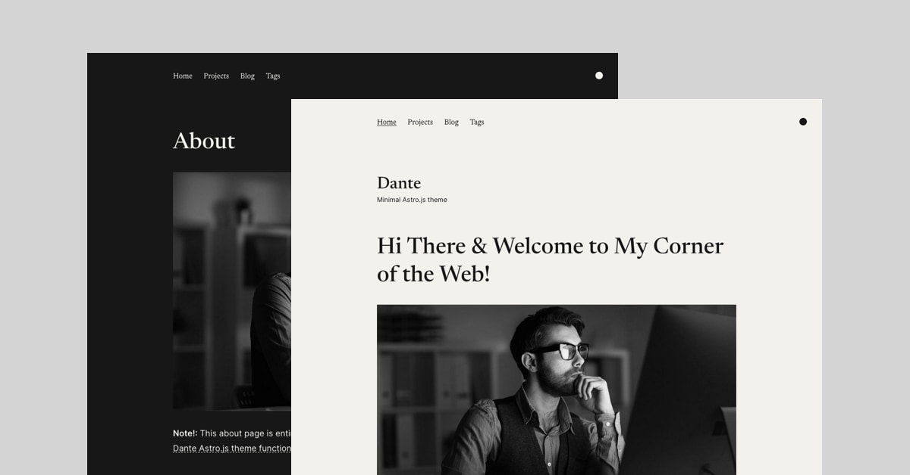

<<<<<<< Updated upstream
# Astro Starter Kit: Blog

```
npm create astro@latest -- --template blog
```

[](https://stackblitz.com/github/withastro/astro/tree/latest/examples/blog)
[](https://codesandbox.io/p/sandbox/github/withastro/astro/tree/latest/examples/blog)
[](https://codespaces.new/withastro/astro?devcontainer_path=.devcontainer/blog/devcontainer.json)

> 🧑‍🚀 **Seasoned astronaut?** Delete this file. Have fun!


Features:

- ✅ Minimal styling (make it your own!)
- ✅ 100/100 Lighthouse performance
=======
# Dante - Astro & Tailwind CSS Theme by justgoodui.com

Dante is a single-author blog and portfolio theme for Astro.js. Featuring a minimal, slick, responsive and content-focused design. For more Astro.js themes please check [justgoodui.com](https://justgoodui.com/).



[](https://app.netlify.com/start/deploy?repository=https://github.com/JustGoodUI/dante-astro-theme)

If you click this☝️ button, it will create a new repo for you that looks exactly like this one, and sets that repo up immediately for deployment on Netlify.

## Theme Features:

- ✅ Dark and light color mode
- ✅ Hero section with bio
- ✅ Portfolio collection
- ✅ Pagination support
- ✅ Post tags support
- ✅ Subscription form
- ✅ View transitions
- ✅ Tailwind CSS
- ✅ Mobile-first responsive layout
>>>>>>> Stashed changes
- ✅ SEO-friendly with canonical URLs and OpenGraph data
- ✅ Sitemap support
- ✅ RSS Feed support
- ✅ Markdown & MDX support

<<<<<<< Updated upstream
## 🚀 Project Structure

Inside of your Astro project, you'll see the following folders and files:

```
=======
## Template Integrations

- @astrojs/tailwind - https://docs.astro.build/en/guides/integrations-guide/tailwind/
- @astrojs/sitemap - https://docs.astro.build/en/guides/integrations-guide/sitemap/
- @astrojs/mdx - https://docs.astro.build/en/guides/markdown-content/
- @astrojs/rss - https://docs.astro.build/en/guides/rss/

## Project Structure

Inside of Dante Astro theme, you'll see the following folders and files:

```text
>>>>>>> Stashed changes
├── public/
├── src/
│   ├── components/
│   ├── content/
<<<<<<< Updated upstream
│   ├── layouts/
│   └── pages/
├── astro.config.mjs
├── README.md
├── package.json
=======
│   ├── data/
│   ├── icons/
│   ├── layouts/
│   ├── pages/
│   ├── styles/
│   └── utils/
├── astro.config.mjs
├── package.json
├── README.md
>>>>>>> Stashed changes
└── tsconfig.json
```

Astro looks for `.astro` or `.md` files in the `src/pages/` directory. Each page is exposed as a route based on its file name.

<<<<<<< Updated upstream
There's nothing special about `src/components/`, but that's where we like to put any Astro/React/Vue/Svelte/Preact components.
=======
There's nothing special about `src/components/`, but that's where we like to put any Astro (`.astro`) components.
>>>>>>> Stashed changes

The `src/content/` directory contains "collections" of related Markdown and MDX documents. Use `getCollection()` to retrieve posts from `src/content/blog/`, and type-check your frontmatter using an optional schema. See [Astro's Content Collections docs](https://docs.astro.build/en/guides/content-collections/) to learn more.

Any static assets, like images, can be placed in the `public/` directory.

<<<<<<< Updated upstream
## 🧞 Commands
=======
## Astro.js Commands
>>>>>>> Stashed changes

All commands are run from the root of the project, from a terminal:

| Command                   | Action                                           |
| :------------------------ | :----------------------------------------------- |
| `npm install`             | Installs dependencies                            |
<<<<<<< Updated upstream
| `npm run dev`             | Starts local dev server at `localhost:3000`      |
=======
| `npm run dev`             | Starts local dev server at `localhost:4321`      |
>>>>>>> Stashed changes
| `npm run build`           | Build your production site to `./dist/`          |
| `npm run preview`         | Preview your build locally, before deploying     |
| `npm run astro ...`       | Run CLI commands like `astro add`, `astro check` |
| `npm run astro -- --help` | Get help using the Astro CLI                     |

<<<<<<< Updated upstream
## 👀 Want to learn more?

Check out [our documentation](https://docs.astro.build) or jump into our [Discord server](https://astro.build/chat).

## Credit

This theme is based off of the lovely [Bear Blog](https://github.com/HermanMartinus/bearblog/).
=======
## Want to learn more about Astro.js?

Check out [our documentation](https://docs.astro.build) or jump into our [Discord server](https://astro.build/chat).

## Credits

- Demo content generate with [Chat GPT](https://chat.openai.com/)
- Images for demo content from [Unsplash](https://unsplash.com/)

## Astro Themes by Just Good UI

- [Ovidius](https://github.com/JustGoodUI/ovidius-astro-theme) is a free single author blog theme.

## License

Licensed under the [GPL-3.0](https://github.com/JustGoodUI/dante-astro-theme/blob/main/LICENSE) license.
>>>>>>> Stashed changes
